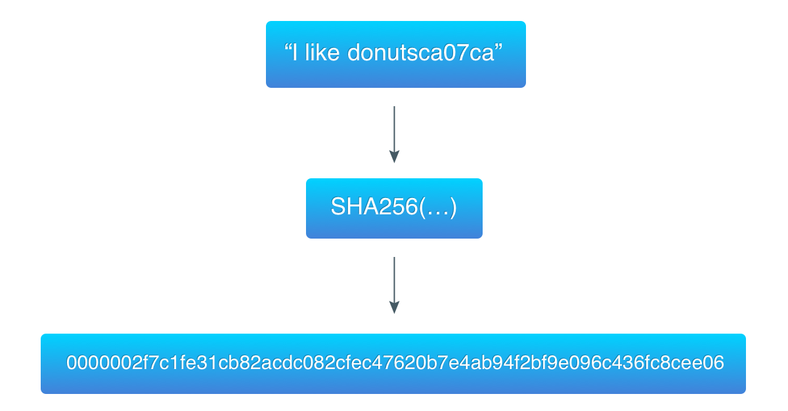

# 实验二 区块链共识协议


- [实验二 区块链共识协议](#实验二-区块链共识协议)
    - [介绍](#介绍)
    - [区块链共识协议](#区块链共识协议)
        - [工作量证明（POW）](#工作量证明pow)
        - [哈希函数](#哈希函数)
        - [区块链哈希](#区块链哈希)
    - [代码部分](#代码部分)
        - [完成部分](#完成部分)
        - [bonus](#bonus)
    - [参考资料](#参考资料)


## 介绍

之前的实验中，我们简单构建了一个区块链的数据结构以及对应持久化操作的数据库。这样，我们就可以简单地进行区块的写入和具体的操作了。同时，我们也了解到了一些区块链的基本特点：每个区块都是连接在上一个区块上的。同时，我们目前的区块链有这样的特点：添加区块是相对比较容易的。但是，对于真正的区块链我们都知道：添加一个区块需要所有节点达成共识，所以是一个相当复杂的工作。在本次实验中，我们就要进行对于共识部分的补充，来保证区块链的安全性和一致性。

## 区块链共识协议

区块链共识的关键思想就是为了结点通过一些复杂的计算操作来获取写入区块的权利。这样的复杂工作量是为了保证区块链的安全性和一致性。如果是对应比特币、以太坊等公有链的架构，对于写入的区块会得到相应的奖励（俗称挖矿）。

根据[比特币的白皮书](https://bitcoin.org/bitcoin.pdf),共识部分是为了决定谁可以写入区块的问题，区块链的决定是通过最长链来表示的，这个是因为最长的区块对应有最大的工作量投入在其中。相应地，为了保证区块链的出块保持在一个相对比较稳定的值，对应地，对进行区块链共识难度的调整来保证出块速度大致保持一致。对应比特币来说，写入区块的节点还对应会获得奖励。

### 工作量证明（POW）

工作量的证明机制，简单来说就是通过提交一个容易检测，但是难以计算的结果，来证明节点做过一定量的工作。对应的算法需要有两个特点：计算是一件复杂的事情，但是证明结果的正确与否是相对简单的。对应地行为，可以类比生活中考驾照、获取毕业证等。

工作量证明由Cynthia Dwork 和Moni Naor 1993年在学术论文中首次提出。而工作量证明（POW）这个名词，则是在1999年 Markus Jakobsson 和Ari Juels的文章中才被真正提出。在发明之初，POW主要是为了抵抗邮件的拒绝服务攻击和垃圾邮件网关滥用，用来进行垃圾邮件的过滤使用。POW要求发起者进行一定量的运算，消耗计算机一定的时间。

### 哈希函数

哈希函数是输入数据进行一种函数计算，获取一个独特的表示。哈希函数需要满足如下的性质：

1. 可以接受任意大小的输入
2. 输出是固定长度的
3. 计算哈希的过程相对是比较简单的，时间都在O(n)

对于区块链的哈希函数，也需要满足一定优秀的性质：

1. 原始数据不能直接通过哈希值来还原，哈希值是没法解密的。
2. 特定数据有唯一确定的哈希值，并且这个哈希值很难出现两个输入对应相同哈希输出的情况。
3. 修改输入数据一比特的数据，会导致结果完全不同。
4. 没有除了穷举以外的办法来确定哈希值的范围。

### 区块链哈希

比特币采用了[哈希现金(hashcash)](https://en.wikipedia.org/wiki/Hashcash)的工作量证明机制，也就是之前说过的用在垃圾邮件过滤时使用的方法，对应流程如下：

1. 从区块链中获取一些公开的数据，对应本次实验我们需要获取**上一个区块哈希值(32位)，当前区块数据对应哈希（32位），时间戳，区块难度，随机数**。对应数据直接进行合并的操作来进行合并。
2. 添加计数器，作为随机数。计算器从0开始基础，每个回合**+1**
3. 对于上述的数据来进行一个哈希的操作。
4. 判断结果是否满足计算的条件：
   1. 如果符合，则得到了满足结果。
   2. 如果没有符合，从2开始重新直接2、3、4步骤。

从中也可以开出，这是一个"非常暴力"的算法。这也是为什么这个算法需要指数级的时间。

这里举一个简单的例子，对应数据为`I like donuts`，`ca07ca`是对应的前一个区块哈希值



## 代码部分

```
const targetBits = 10 //难度值
```

在本次实验中，我们选用了一个固定的难度值来进行计算。10位的难度值意味着我们需要获取一个**1<<(255-10)**小的数。

```
type ProofOfWork struct {
	block  *Block
	target *big.Int
}
```

`ProofOfWork`是一个区块的指针和一个目标值，我们使用了`big.Int`来得到一个大端的数据，对应难度就是之前提到的`1<<(255-targetBits)`。

在这个实验中，我们还需要注意到的是`第一个区块对应的hash`是一个为空的值。在这个实验中，可以使用`"crypto/sha256`来进行哈希函数的操作。对于*int*转*byte*的操作可以使用`utiles.go`里的`IntToHex`函数来实现

### 完成部分

- proofofwork.go
  - Run()  pow计算部分
  - Validate()  pow结果的验证工作

### bonus

自己编写一个满足区块链要求的哈希函数（如sha256，sha3），并说明其满足区块链哈希函数的性质。

## 参考资料

[区块链哈希算法](https://en.bitcoin.it/wiki/Block_hashing_algorithm)

[POW算法](https://en.bitcoin.it/wiki/Proof_of_work)

[哈希现金](https://en.bitcoin.it/wiki/Hashcash)


